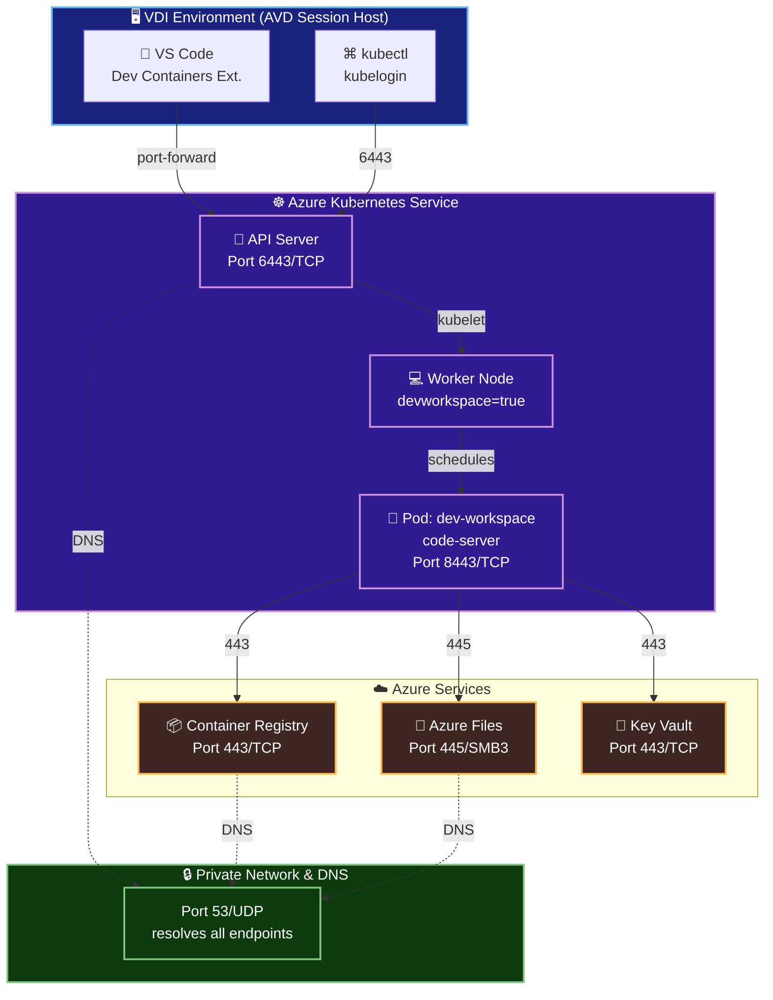

<div align="center">

# SHIPYARD

### Secure, enterprise-grade remote dev containers  
### Thin-client VDI + managed AKS developer compute

</div>

## Overview

This repository provides infrastructure and deployment patterns for hosting remote development containers in Azure Kubernetes Service (AKS). The core philosophy: **move resource-intensive developer workloads into a managed, scalable platform while using thin-client VDI for UI and connectivity**.

### The Problem Solved

Enterprise VDI environments (AVD, Citrix, etc.) are typically **resource-constrained**:
- Limited CPU and RAM per user
- Shared desktop infrastructure with usage policies
- Storage and network isolation requirements

Shipping heavy developer tools (Docker, language runtimes, build systems, databases) on constrained desktops is inefficient and hard to scale.

### The Solution

**Move compute to AKS**:
- Developers use VS Code running *on the VDI desktop* to attach to a remote dev container in AKS
- The container gets full CPU, RAM, storage, and network resources
- VDI becomes a thin client: just a UI and connectivity layer
- Scales independently from desktop constraints
- Easier to manage, version, and secure workload environments
- Access is scoped per user: each workspace runs in a dedicated namespace with user-scoped RBAC to prevent cross-user container access

### Deployment Scenarios

**Greenfield** — Deploy complete infrastructure from scratch:
- Full AKS cluster, networking, storage, and container registry
- Terraform-based infrastructure as code (IaC)
- Includes optional Azure Virtual Desktop (AVD) for enterprise end-user compute
- See [DEPLOYMENT_RUNBOOK.md](docs/DEPLOYMENT_RUNBOOK.md)

**Brownfield** — Use existing AKS clusters:
- Per-user dev container provisioning on your existing cluster
- Assumes external DevOps infrastructure (image registry, CI/CD)
- Works with any end-user compute (VDI, local machine, cloud workstation)
- See [DEPLOYMENT_RUNBOOK_BROWNFIELD.md](docs/DEPLOYMENT_RUNBOOK_BROWNFIELD.md)

### Core Components

1. **`devcontainer/`**: Image and runtime assets for remote dev workspaces (VS Code server bootstrap, manifests, scripts)
2. **`ops/scripts/`**: Provisioning, deprovisioning, and federation scripts for platform operators
3. **`infra/`**: Optional demo topology in Terraform (private networking, enterprise controls)

### Typical Workflow (VDI + Remote Dev Container)

1. Developer launches a **thin-client VDI session** (AVD, Citrix, etc.)
2. Opens **VS Code** on the VDI desktop (minimal resource footprint)
3. Uses **Dev Containers extension** to attach to a **remote dev container in AKS**
4. All build, test, debug, and compile work happens **in AKS** (not on the constrained VDI)
5. VS Code displays the IDE UI locally (low bandwidth, responsive)

**Result**: Developers get powerful, isolated compute without taxing the shared VDI infrastructure.

*Note: Non-VDI environments can connect directly to AKS using the same workflow.*

For deployment instructions:
- **Greenfield (full infrastructure)**: [DEPLOYMENT_RUNBOOK.md](docs/DEPLOYMENT_RUNBOOK.md)
- **Brownfield (existing AKS)**: [DEPLOYMENT_RUNBOOK_BROWNFIELD.md](docs/DEPLOYMENT_RUNBOOK_BROWNFIELD.md)

For end-user connection instructions: [AKS DevContainer Onboarding](docs/AKS_DEVCONTAINER_ONBOARDING.md)

## Architecture



All traffic is **encrypted, private, and confined to your VNet**. For detailed port requirements, see [PORT_REQUIREMENTS.md](docs/PORT_REQUIREMENTS.md).

## Repository Layout

```text
.
|- devcontainer/
|  |- Dockerfile
|  |- manifests/
|  |- scripts/
|- ops/
|  |- scripts/
|- infra/
|  |- demo/
|- .specify/
|  |- templates/
|  |- memory/
|- .github/
|  |- ISSUE_TEMPLATE/
|  |- PULL_REQUEST_TEMPLATE.md
```

## Getting Started

After cloning, activate the repo's Git hooks (enforces commit message format and protects `main`/`master` client-side):

```bash
bash .githooks/setup-hooks.sh
```

When Terraform files under `infra/` are staged, the `pre-commit` hook runs:

- `terraform fmt -check -recursive`
- `terraform init -backend=false`
- `terraform validate`
- `tflint` (if installed)

## Notes

- This is a scaffold intended for iteration, not a production-ready deployment.
- The Terraform topology uses Azure Verified Modules (AVM) and defaults to private networking controls with disabled public endpoints where supported.
- The VS Code server startup script uses `code-server` as a practical bootstrap for remote browser/editor access patterns.
