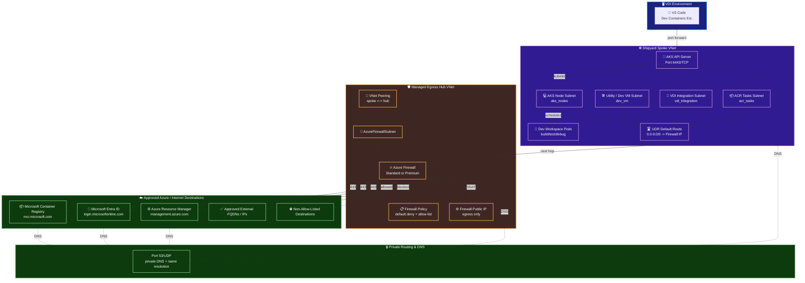

# Managed Egress Topology

This document describes the managed egress path for the Shipyard greenfield deployment when `managed_egress_enabled = true` and `enable_nat_gateway = false`.

In this mode, outbound traffic from developer workloads is forced through a dedicated Azure Firewall deployed in a separate hub virtual network. The spoke virtual network hosts the Shipyard AKS cluster and related workload subnets. Hub-and-spoke peering plus user-defined routes ensure outbound traffic is inspected and filtered before it leaves the private network.

## Topology Summary

- The Shipyard spoke VNet continues to host AKS, ACR task, VDI integration, and utility VM subnets.
- A dedicated egress hub VNet contains `AzureFirewallSubnet` and the Azure Firewall instance.
- Bidirectional VNet peering connects the spoke and hub VNets.
- User-defined routes on outbound-capable spoke subnets send `0.0.0.0/0` to the firewall private IP.
- Azure Firewall Policy applies a default-deny posture with explicit FQDN and optional IP/CIDR allow-lists.
- Platform-critical destinations such as `management.azure.com`, `login.microsoftonline.com`, and `mcr.microsoft.com` are preserved in the effective allow-list.

## Managed Egress Diagram

## Traffic Flow

1. A developer connects from the VDI environment to a remote workspace running in AKS.
2. Workload traffic leaves the outbound-capable spoke subnet.
3. The subnet route table sends the default route to the firewall private IP in the hub.
4. Azure Firewall evaluates the request against the attached firewall policy.
5. Allowed traffic is SNATed through the firewall public IP and sent to approved destinations.
6. Non-allow-listed destinations are denied and can be observed through firewall diagnostics.

## Subnets Routed Through Managed Egress

- `aks_nodes`
- `acr_tasks`
- `vdi_integration`
- `dev_vm`

These are the same outbound-capable subnets updated by the managed egress route table associations in [infra/networking.tf](../infra/networking.tf).

## Policy Model

- Default action: deny outbound traffic unless a rule explicitly allows it.
- FQDN allow-list: application rules for approved DNS destinations.
- Optional IP/CIDR allow-list: network rules for endpoints that cannot be expressed as FQDNs.
- Platform dependency preservation: required Azure control-plane and image registry destinations are merged into the effective allow-list.

## When To Use Managed Egress

Use managed egress when you need one or more of the following:

- Centralized outbound inspection for AKS-hosted developer workloads.
- Deny-by-default control of external dependencies.
- A hub-and-spoke network pattern that cleanly separates workload hosting from egress enforcement.
- A transition path away from broad NAT-based outbound access.

For operator steps and transition guidance, see [DEPLOYMENT_RUNBOOK.md](./DEPLOYMENT_RUNBOOK.md).
